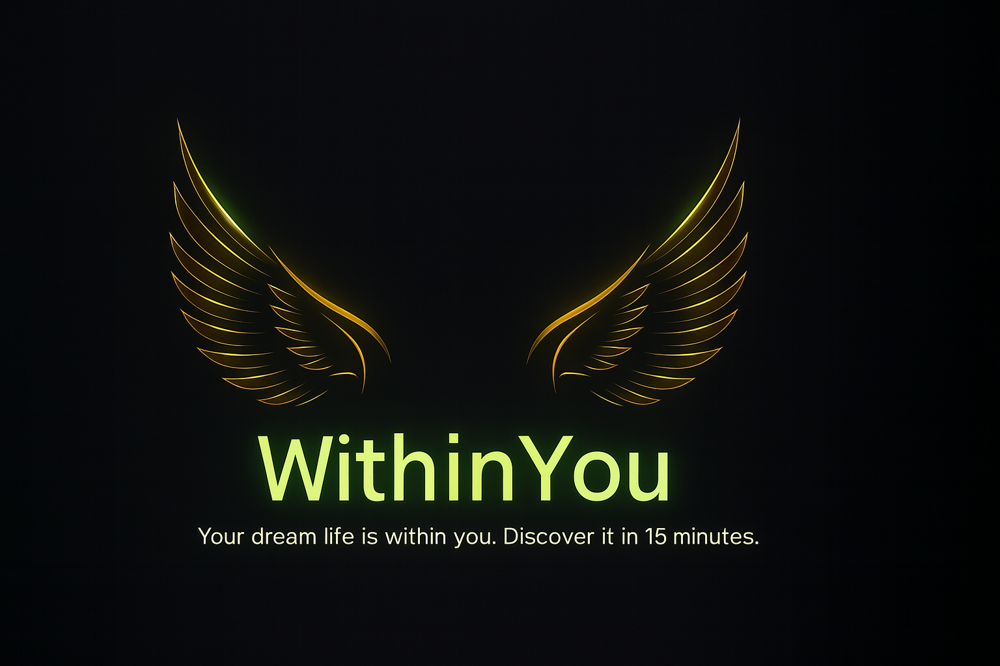

WithinYou.ai
“Your dream life is within you. Discover it in 15 minutes.”

Live Site: https://withinyou-ai.vercel.app

GitHub Repo: https://github.com/smzubs/withinyou-ai

✨ Overview

WithinYou.ai is a next-generation self-discovery platform powered by AI.
In just 15 minutes, users uncover their unique inner strengths, values, and life direction through intelligent, personalized conversations.

The goal: Help people gain deep clarity and actionable guidance for building their dream life.

🧠 Mission

To empower every human being to understand themselves deeply —
so they can live with purpose, confidence, and peace.

WithinYou.ai acts as a mirror powered by AI, asking guided questions, interpreting your responses, and recommending:

🎯 Personal archetype insights

📚 Book & resource recommendations

🧩 Skill path suggestions for career or life goals

❤️ Personalized reflection prompts

🚀 Features (v1.1 — Clarity Launch Blueprint)

⚡ 15-Minute Discovery Flow — guided, question-based clarity session

🪞 Personalized AI reflections — intelligent feedback instantly

💡 Book & Skill Recommendations — curated from user psychology

🔐 Privacy-first design — your answers belong only to you

🌙 Modern dark interface — calm, elegant, and distraction-free

🧰 Tech Stack
Layer	Tools & Frameworks
Frontend	Next.js 15 (Turbopack)
, React, TypeScript
UI/UX	Tailwind CSS, Framer Motion, Shadcn/UI
Auth (upcoming)	Clerk
Database	Neon (PostgreSQL Cloud)
Cache & Analytics	Upstash Redis, Langfuse
Payments (upcoming)	Stripe
AI Integration	OpenAI API / Anthropic Claude API
Deployment	Vercel (CDN + Edge Functions)
Version Control	Git + GitHub
🏗️ Project Structure
withinyou-ai/
├── src/
│   ├── app/
│   │   ├── page.tsx          # Landing page
│   │   ├── layout.tsx        # Metadata + global layout
│   ├── components/           # UI components
│   ├── styles/               # Tailwind and global styles
├── public/                   # Static assets (favicon, images)
├── package.json              # Dependencies
├── README.md                 # This file

💻 Run Locally
# Clone the repo
git clone https://github.com/smzubs/withinyou-ai.git
cd withinyou-ai

# Install dependencies
pnpm install

# Run the dev server
pnpm dev

Now open http://localhost:3000
 to view your app.

🧩 Roadmap
Phase	Title	Focus
✅ Phase 1	Clarity Launch (v1.1)	Landing Page + Vision Demo
🔜 Phase 2	AI Discovery Engine	Conversational Q&A Flow
🔜 Phase 3	User Dashboard	Saved results + insights
🔜 Phase 4	Premium Layer	Stripe subscription + coaching
🔜 Phase 5	Mobile Apps	iOS + Android (React Native / Expo)
👨‍💻 Founder & Visionary

SM Zobayer
EHS Manager turned AI Product Creator — building tools that help people discover their inner power and purpose.
💡 “Within you lies everything you seek.”

🌍 License

MIT © 2025 WithinYou.ai

🧭 Tagline Reminder

🌱 Your dream life is within you. Discover it in 15 minutes.